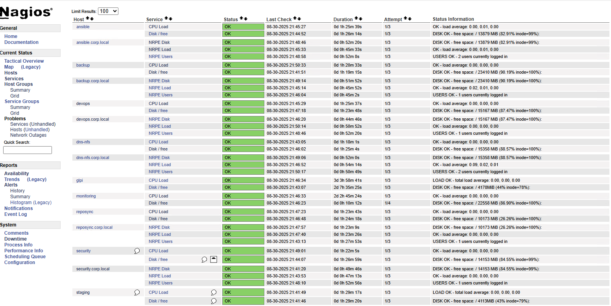

# Monitoring & Observability Overview (Nagios Core + NRPE)
> ⭐ **Featured: Monitoring (Nagios Core + NRPE)** — see [monitoring/README.md](monitoring/README.md)
**Project:** Homelab Infrastructure Projects  
**Doc type:** Root README (executive + technical overview)  
**Last updated:** 2025-08-31

> _“Green across the board.”_ The screenshots below show **all hosts UP** and **all services OK** in Nagios after the final fixes (NRPE + local checks).




---

## 1) Scope & Goals
- Stand up **Nagios Core** on `monitoring.corp.local` (RHEL 9) for host/service monitoring.
- Deploy **NRPE** agents and plugins to all Linux hosts (RHEL 9/10, CentOS Stream 9, Ubuntu).
- Standardize common checks: `CPU load`, `Disk / free`, `NRPE Users` (logged-in users), etc.
- Ensure clean **EPEL** sourcing for EL9 plugins (local mirror path), fast & deterministic patching.
- Keep everything **documented & reproducible** (Ansible + GitHub).

## 2) Final Working Environment (Host Map)
| IP | Hostname | Role |
|---|---|---|
| 192.168.1.11 | **glpi.corp.local** | GLPI |
| 192.168.1.12 | **ansible.corp.local** | Ansible Controller (RHEL 10) |
| 192.168.1.13 | **reposync.corp.local** | Repo mirror (EL9 BaseOS/AppStream/CRB/EPEL) |
| 192.168.1.14 | **dns-nfs.corp.local** | DNS + NFS |
| 192.168.1.15 | **monitoring.corp.local** | **Nagios Core** |
| 192.168.1.16 | **backup.corp.local** | Backups (rsync) |
| 192.168.1.17 | **syslog.corp.local** | Central logs (rsyslog) |
| 192.168.1.18 | **staging.corp.local** | Staging / SMTP relay |
| 192.168.1.19 | **devops.corp.local** | DevOps sandbox |
| 192.168.1.20 | **security.corp.local** | Security tooling |

> All hosts appear OK in Nagios with clean `RTA` and `packet loss = 0%` in the host `PING` checks.

## 3) What We Built
- **Nagios Core** web UI with auth (`nagiosadmin`) and `cgi.cfg` privileges.
- **Host/Service templates** and consistent check naming across the fleet.
- **NRPE** on each client with a consistent **`allowed_hosts=`** list including the monitor (`192.168.1.15`).
- **Local vs Remote**: the `monitoring` host uses **`check_local_disk`** for `Disk / free`; all other nodes use NRPE-exposed commands for the same check.
- **Firewall/SELinux** correctly handled (`5666/tcp` open; services enabled on boot).

## 4) EPEL Mirror (that fed our plugins)
We synced EPEL locally to avoid upstream flakiness and bandwidth churn. The large initial sync pulled **~9K+ packages** (first pass), then we stabilized with resumable runs.

**Local layout (example):**
```
/mnt/hp2-repo/repos/el9/epel/9/Everything/x86_64/epel/
├── Packages/
└── repodata/repomd.xml
```

**Client repo file** (EL9) pointing at our mirror:
```ini
# /etc/yum.repos.d/local-epel.repo
[local-epel]
name=Local EPEL 9 (mirror)
baseurl=http://reposync.corp.local/epel/9/Everything/x86_64/epel/
enabled=1
gpgcheck=0
```

**Sanity checks that worked:**
```bash
curl -I http://reposync.corp.local/epel/9/Everything/x86_64/epel/repodata/repomd.xml
sudo dnf clean all && sudo dnf makecache --disablerepo="*" --enablerepo="local-epel"
sudo dnf list nagios-plugins\* nrpe --enablerepo=local-epel
```

> We validated with `200 OK` responses and `dnf list` populated from the local mirror.

## 5) High-Level Build Steps (Working Path)
**On monitoring.corp.local (RHEL 9):**
```bash
# EPEL enabled via local mirror
sudo dnf -y install nagios nagios-plugins-all httpd php nrpe nagios-plugins-nrpe

# Web login
sudo htpasswd -c /etc/nagios/passwd nagiosadmin

# Enable services
sudo systemctl enable --now nagios httpd
sudo firewall-cmd --add-service=http && sudo firewall-cmd --add-service=http --permanent
```

**On each EL9 client:**
```bash
sudo dnf -y install nrpe nagios-plugins-all
sudo sed -i 's/^allowed_hosts=.*/allowed_hosts=127.0.0.1,192.168.1.15/' /etc/nagios/nrpe.cfg
sudo systemctl enable --now nrpe
sudo firewall-cmd --add-port=5666/tcp && sudo firewall-cmd --add-port=5666/tcp --permanent
```

**On Ubuntu clients:**
```bash
sudo apt update
sudo apt -y install nagios-nrpe-server nagios-plugins
sudo sed -i 's/^allowed_hosts=.*/allowed_hosts=127.0.0.1,192.168.1.15/' /etc/nagios/nrpe.cfg
sudo systemctl enable --now nagios-nrpe-server
sudo ufw allow 5666/tcp
```

**On the monitoring server – host/service objects (illustrative):**
```cfg
# /etc/nagios/objects/hosts.cfg
define host{{ use linux-server; host_name backup;    address 192.168.1.16 }}

# /etc/nagios/objects/services.cfg
define service{{ use generic-service; host_name backup; service_description CPU load;   check_command check_nrpe!check_load }}
define service{{ use generic-service; host_name backup; service_description Disk / free; check_command check_nrpe!check_disk_root }}
define service{{ use generic-service; host_name backup; service_description NRPE Users;  check_command check_nrpe!check_users }}
```

**NRPE command map on clients:**
```ini
# /etc/nagios/nrpe.d/common.cfg
command[check_load]=/usr/lib64/nagios/plugins/check_load -w 2.0,1.5,1.0 -c 4.0,3.0,2.0
command[check_users]=/usr/lib64/nagios/plugins/check_users -w 3 -c 5
command[check_procs]=/usr/lib64/nagios/plugins/check_procs -w 250 -c 400
command[check_disk_root]=/usr/lib64/nagios/plugins/check_disk -w 20% -c 10% -p /
```

> On `monitoring` itself, `Disk / free` uses `check_local_disk` as the service command.

## 6) Ansible (What We Ran That Worked)
**Inventory sketch (subset):**
```ini
[monitoring]
monitoring.corp.local

[linux]
ansible.corp.local
backup.corp.local
devops.corp.local
dns-nfs.corp.local
reposync.corp.local
security.corp.local
staging.corp.local
syslog.corp.local
glpi.corp.local
```

**Deploy NRPE to all Linux hosts:**
```yaml
# ansible/playbooks/deploy-nrpe.yml
- name: Deploy NRPE + standard checks
  hosts: linux
  become: true
  tasks:
    - name: Install (EL)
      package:
        name: "{{{{ item }}}}"
        state: present
      loop: ["nrpe", "nagios-plugins-all"]
      when: ansible_os_family == "RedHat"

    - name: Install (Debian/Ubuntu)
      apt:
        name: ["nagios-nrpe-server", "nagios-plugins"]
        state: present
        update_cache: true
      when: ansible_os_family == "Debian"

    - name: Drop NRPE common commands
      copy:
        dest: /etc/nagios/nrpe.d/common.cfg
        content: |
          command[check_load]=/usr/lib64/nagios/plugins/check_load -w 2.0,1.5,1.0 -c 4.0,3.0,2.0
          command[check_users]=/usr/lib64/nagios/plugins/check_users -w 3 -c 5
          command[check_procs]=/usr/lib64/nagios/plugins/check_procs -w 250 -c 400
          command[check_disk_root]=/usr/lib64/nagios/plugins/check_disk -w 20% -c 10% -p /
      notify: restart nrpe

    - name: Allow monitoring server
      lineinfile:
        path: /etc/nagios/nrpe.cfg
        regexp: '^allowed_hosts='
        line: 'allowed_hosts=127.0.0.1,192.168.1.15'
      notify: restart nrpe

  handlers:
    - name: restart nrpe
      service:
        name: "{{{{ 'nrpe' if ansible_os_family == 'RedHat' else 'nagios-nrpe-server' }}}}"
        state: restarted
        enabled: true
```

**Push host/service objects to monitoring:**
```yaml
# ansible/playbooks/push-nagios-objects.yml
- name: Push Nagios object files
  hosts: monitoring
  become: true
  tasks:
    - copy: src=files/hosts.cfg dest=/etc/nagios/objects/hosts.cfg
    - copy: src=files/services.cfg dest=/etc/nagios/objects/services.cfg
    - command: nagios -v /etc/nagios/nagios.cfg
      register: verify
      changed_when: false
    - debug: var=verify.stdout
    - systemd:
        name: nagios
        state: restarted
```

```bash
git checkout -b feat/monitoring-docs
git add ansible/playbooks/deploy-nrpe.yml ansible/playbooks/push-nagios-objects.yml
git add monitoring/README.md docs/monitoring/*.md nagios/objects/*.cfg
git commit -m "docs(monitoring): Nagios Core + NRPE — install, config, Ansible, and proof"
git push -u origin feat/monitoring-docs
```

## 9) Troubleshooting Cheat Sheet (NRPE/Nagios)
- **Is NRPE open?** `ss -ltnp | grep 5666` on clients; firewall allows 5666/tcp.
- **Allowed hosts correct?** `/etc/nagios/nrpe.cfg → allowed_hosts=127.0.0.1,192.168.1.15`.
- **Plugins path mismatched?** Use `which check_disk` and update `command[...]` accordingly.
- **Nagios config valid?** `nagios -v /etc/nagios/nagios.cfg` before restart.
- **SELinux denials?** `ausearch -m avc -ts recent` then `setsebool -P nagios_run_sudo on` if needed.
- **EPEL mirror sanity:** `curl -I http://reposync.corp.local/.../repodata/repomd.xml`.
