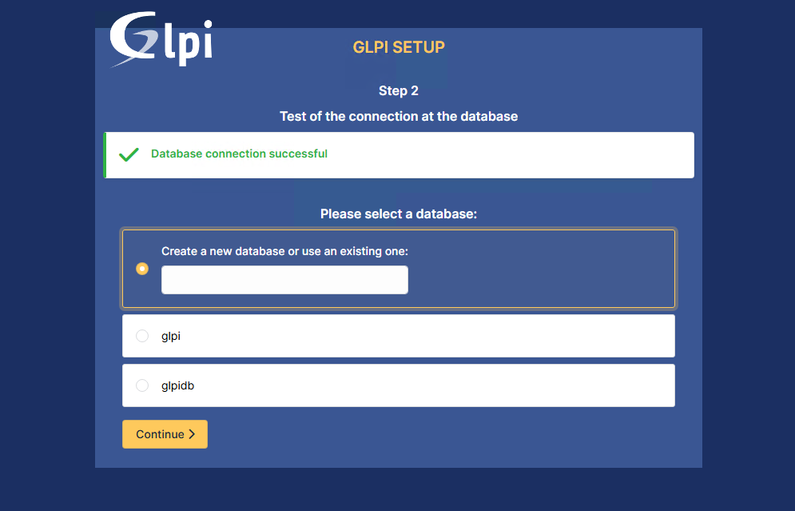
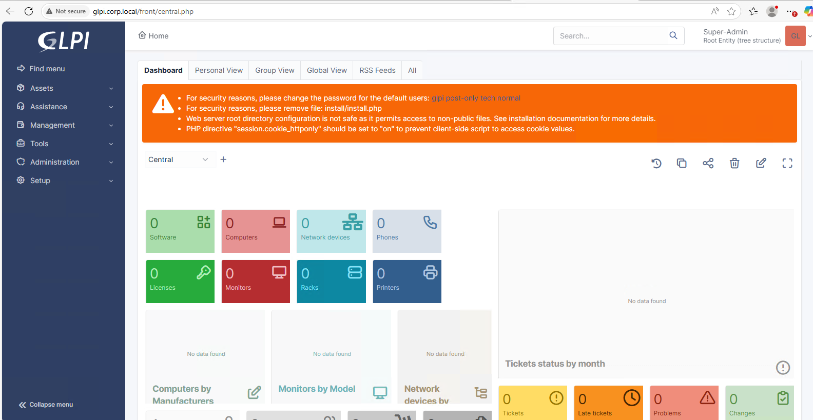
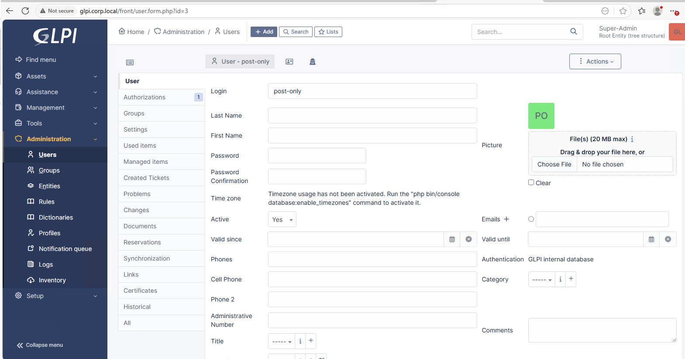

# 🌐 Homelab Infrastructure Projects

Welcome to my **Hybrid IT Lab** — a fully-documented infrastructure playground where I design, build, and automate a production-style environment using real-world tools, enterprise practices, and hands-on automation.

---

## ⭐ Featured

- **AD ↔ Linux Integration Runbook**
- **Monitoring (Nagios Core + NRPE) Runbook**
- **Centralized Logging (rsyslog)**

---

## 📘 Read the step-by-step guides

- **AD ↔ Linux Integration**
  guide: [ansible/docs/ad-linux-integration/README.md](ansible/docs/ad-linux-integration/README.md)

- **Monitoring (Nagios Core + NRPE)**
  guide: [monitoring/README.md](monitoring/README.md)
  quick overview: [monitoring/overview.md](monitoring/overview.md)

- **Centralized Logging (rsyslog)**
  guide: [monitoring/centralized-logging.md](monitoring/centralized-logging.md)

---

### 🔎 Recent activity
See recent changes: <https://github.com/lummidizzle/homelab-infrastructure-projects/commits/main>  
Live Demo (GitHub Pages): [View Documentation](docs/index.md)

---

## 🚀 Project Vision

This repo is my living portfolio: an evolving record of my journey in systems engineering, automation, and security. It’s designed to reflect **real-world enterprise IT** — with servers, monitoring, backups, security hardening, and orchestration — all built, broken, and rebuilt in a controlled homelab.

Key goals:
- Automation-first infrastructure (Ansible + scripts)
- Security-focused (RBAC, ACLs, monitoring, log management)
- Hybrid IT model (Linux + Windows integration)
- Documented end-to-end for repeatability and learning

---

## 🖥️ Server Roles & Functions

| Server Name              | Role / Function                                                |
|---------------------------|---------------------------------------------------------------|
| **ansible.corp.local**    | Automation control node, roles & playbooks (Ansible Core)     |
| **backup.corp.local**     | Backup configuration, rsync jobs, and retention policies      |
| **monitoring.corp.local** | Monitoring with Nagios Core + service checks + alerting       |
| **reposync.corp.local**   | Local repo mirror (BaseOS, AppStream, CRB, EPEL)              |
| **syslog.corp.local**     | Centralized log collection, rotation, archival                |
| **dns-nfs.corp.local**    | DNS, Active Directory integration, and shared NFS exports     |
| **devops.corp.local**     | CI/CD experiments, script automation, and infra utilities     |
| **security.corp.local**   | Security hardening, AIDE, auditd, ClamAV, rootkit scanning    |
| **glpi.corp.local**       | IT asset management and inventory (GLPI server)              |
| **windows-server-2022.corp.local** | Active Directory, DNS, GPOs, Kerberos auth, domain configs |
| **ubuntu-lite.corp.local** | Lightweight Ubuntu servers for testing + validation         |

---

## ⚙️ Technologies in Use

- **Operating Systems:** RHEL 9/10, CentOS Stream 9, Ubuntu Lite, Windows Server 2022
- **Automation & Configuration:** Ansible, GitHub Actions, Bash & PowerShell scripting
- **Monitoring & Logging:** Nagios Core, syslog/rsyslog, AIDE (File Integrity Monitoring)
- **Backup & Recovery:** Rsync, logrotate, cron-based snapshot jobs
- **Version Control & Documentation:** GitHub, GitHub Pages, Markdown automation
- **Security:** ACLs, RBAC, auditd, STIG-aligned hardening practices
- **Networking & Services:** AD/DNS integration, NFS shares, repo mirrors

---

## 🤖 Automation Highlights

- **GitHub Actions CI/CD**
  - Auto-deploy repo → GitHub Pages
  - Weekly cleanup & README refresh
  - Automated VM inventory sync + Git push
- **Ansible Playbooks**
  - Security hardening across Linux servers
  - Monitoring role (Nagios installation, host/service configs)
  - Backup role (rsync, cron, logrotate)
- **PowerShell & Bash Scripts**
  - VM cleanup and optimization
  - Repo sync and package management
  - Inventory collection and central consolidation

---

## 📂 Repo Structure

homelab-infrastructure-projects/  
  ├── ansible/        # Ansible roles, playbooks, inventory  
  ├── scripts/        # PowerShell + Bash automation scripts  
  ├── docs/           # Documentation, error logs, architecture notes  
  ├── vm-inventory/   # Auto-generated VM inventory JSONs  
  ├── assets/         # Screenshots, diagrams, and supporting visuals  
  └── README.md       # This file (root overview)

---

## 🏗️ Work in Progress

- [ ] Expand Ansible automation (monitoring, backup, security roles)
- [ ] Add Nagios event handlers for automated service restarts
- [ ] Build centralized compliance enforcement (STIG baseline)
- [ ] Enhance GLPI integration with LDAP/AD
- [ ] Develop visualization dashboards (future Grafana integration)

---

## 📖 Why This Matters

This repo is more than notes — it’s a **blueprint for running IT like an engineer, not just a hobbyist**. Every log, script, and configuration captures real troubleshooting and project experience.

> *“Document everything. Automate the rest.” – Future Me*

---

## 🔗 Resources

- [GitHub Pages Site](https://lummidizzle.github.io/homelab-infrastructure-projects/)
- [Nagios Core Documentation](https://www.nagios.org/documentation/)
- [Ansible Docs](https://docs.ansible.com/)
- [RHEL System Roles](https://access.redhat.com/articles/3050101)

---

## 📌 About

Built and maintained by **Olumide Familusi** — Linux Systems Engineer.  
This repo reflects a hands-on journey toward **automation-first, secure, hybrid infrastructure design**.

<!-- GLPI screenshots (recovered) -->
### GLPI Detail

<!-- GLPI screenshots (recovered) -->
### GLPI Detail

