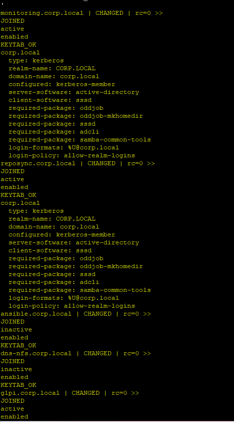

# AD–Linux Integration: Ansible Join & SSSD Baseline (Runbook + Proof)

This doc captures **what we did** to join ~10 EL9/Rocky hosts to **CORP.LOCAL**, lock down logins with **SSSD**, and grant **controlled sudo** via the `linux-admins` AD group. It includes **copy‑paste commands**, **Ansible snippets**, and **screenshots as proof**.

> TL;DR: All Linux hosts are joined to AD, SSSD is active+enabled, access is restricted to `linux-admins@corp.local`, and members (e.g., `oluadmin@corp.local`) have passwordless sudo for package/system operations.

---

## 1) Environment & Goals

- **Windows / AD**
  - Realm: `CORP.LOCAL` (DNS: `corp.local`), DC: `ws2022-dc.corp.local`
  - OU(s): `OU=Groups,DC=corp,DC=local` (for groups), `OU=Linux,OU=Servers,DC=corp,DC=local` (for computer objects)
  - Security group: **linux-admins** (Global/Security)
  - User: **oluadmin** (member of `linux-admins`)

- **Linux**
  - ~10 hosts (EL9/Rocky family)
  - `realmd` + `adcli` + `sssd` baseline
  - Login format: `%U@corp.local`
  - Passwordless sudo (limited): dnf/apt + systemctl/journalctl
  - Restrict interactive logins to AD group: `linux-admins@corp.local`

---

## 2) Windows AD prep (run once on the DC)

```powershell
$DomainDN = "DC=corp,DC=local"

# Ensure an OU for groups exists (or use CN=Users)
if (-not (Get-ADOrganizationalUnit -LDAPFilter '(ou=Groups)' -SearchBase $DomainDN -ErrorAction SilentlyContinue)) { 
  New-ADOrganizationalUnit -Name "Groups" -Path $DomainDN -ProtectedFromAccidentalDeletion $false 
}

# Create group for Linux admin rights
New-ADGroup -Name "linux-admins" -SamAccountName "linux-admins" -GroupScope Global -GroupCategory Security -Path "OU=Groups,$DomainDN"

# Create (or re-use) admin user and add to group
New-ADUser -Name "Olu Admin" -SamAccountName "oluadmin" -UserPrincipalName "oluadmin@corp.local" -Enabled $true `
  -AccountPassword (Read-Host -AsSecureString "Set a password for oluadmin")
Add-ADGroupMember -Identity "linux-admins" -Members "oluadmin"

# Verify
Get-ADGroupMember "linux-admins" | Select Name,SamAccountName
```

---

## 3) Ansible inventory & vars

`group_vars/ad_join_targets.yml`:

```yaml
ad_domain: corp.local
ad_dcs: ["ws2022-dc.corp.local"]
ad_computer_ou: "OU=Linux,OU=Servers,DC=corp,DC=local"

# store this in a vault file, do not commit plaintext
ad_join_user: Administrator@CORP.LOCAL
ad_join_password: "{{ vault_ad_join_password }}"
```

Vault example:
```bash
ansible-vault create group_vars/ad_join_targets.vault.yml
# then add:
# vault_ad_join_password: "CHANGE_ME"
```

---

## 4) Playbooks (Linux side)

### 4.1 `playbooks/ad_domain_join.yml` — join & baseline

- Ensure **time in sync** (chrony) and **DNS** points to the DC
- Install: `realmd adcli sssd sssd-tools oddjob oddjob-mkhomedir samba-common-tools`
- EL9: `authselect select sssd with-mkhomedir`
- Join if not already a member (preferred OU & DC)
- Enable/start **sssd** and validate keytab/realm

Useful ad‑hoc checks:
```bash
adcli testjoin -D corp.local && echo JOIN_OK || echo NOT_JOINED
realm list
sudo klist -k | head -3
```

### 4.2 `playbooks/linux_admins_conventional.yml` — access & sudo

`/etc/sssd/sssd.conf` domain section:
```ini
[domain/corp.local]
access_provider = simple
simple_allow_groups = linux-admins@corp.local
```

`/etc/sudoers.d/99-linux-admins`:
```sudoers
Cmnd_Alias PKG = /usr/bin/dnf, /usr/bin/yum, /usr/bin/apt, /usr/bin/apt-get
Cmnd_Alias SYS = /usr/bin/systemctl, /usr/bin/journalctl
%linux-admins@corp.local ALL=(ALL:ALL) NOPASSWD: PKG, SYS
# (swap for full lab convenience)
# %linux-admins@corp.local ALL=(ALL:ALL) NOPASSWD: ALL
```

Validation baked into the play: `systemctl is-active sssd`, `realm list` (summary), `sudo -lU`, and a `SUDO_OK` smoke test.

---

## 5) Verification & troubleshooting (quick kit)

```bash
systemctl is-active sssd && systemctl is-enabled sssd
getent group "linux-admins@corp.local"
getent passwd "oluadmin@corp.local"
sudo -lU "oluadmin@corp.local" | head
sudo -n true && echo SUDO_OK || echo SUDO_FAIL
```

Common issues we fixed:
- **SSSD inactive** (`ConditionPathExists=/etc/sssd/sssd.conf`) → create config, `chmod 600`, restart
- **Keytab visibility** → run `klist -k` with sudo/root
- **After failed join** (stale machine account) → re‑join / `adcli update` then restart sssd
- **Jinja recursion** → avoid same‑name defaults in vars

---

## 6) Proof (screenshots)


<p align="center"><em>Figure 1. Git status on Ansible repo (files to commit)</em></p>


<p align="center"><em>Figure 2. Windows AD: create OU, linux-admins group, add user via PowerShell</em></p>



<p align="center"><em>Figure 3. realm list (several hosts) showing JOINED + KEYTAB_OK</em></p>


<p align="center"><em>Figure 4. realm list continued (more hosts)</em></p>


<p align="center"><em>Figure 5. realm list final batch</em></p>


<p align="center"><em>Figure 6. Ansible verification summary (sudo/sssd info)</em></p>


<p align="center"><em>Figure 7. Ansible verification summary (continued)</em></p>


<p align="center"><em>Figure 8. Play recap: changes across all hosts</em></p>


<p align="center"><em>Figure 9. Play recap after handler restart (sssd)</em></p>


---

## 7) How to add this to your repo

From your repo root on the Ansible controller:

```bash
# 1) Create the docs folder (if not present)
mkdir -p ansible/docs/ad-linux-integration/images

# 2) Drop the contents of this bundle into that path
#    (if you downloaded a ZIP, extract it so images/ and README.md land under the path above)

# 3) Commit on a new docs branch (recommended)
git checkout -b chore/ad-linux-docs || git checkout chore/ad-linux-docs
git add ansible/docs/ad-linux-integration
git commit -m "docs: AD–Linux integration runbook + proof (join, SSSD, sudo, screenshots)"
git push -u origin HEAD
```

Then open a PR (or keep working on the branch).

---

**Author’s note:** This README is distilled from our live runbook and terminal output over the last 3–5 days and is meant to be copy‑paste friendly.
