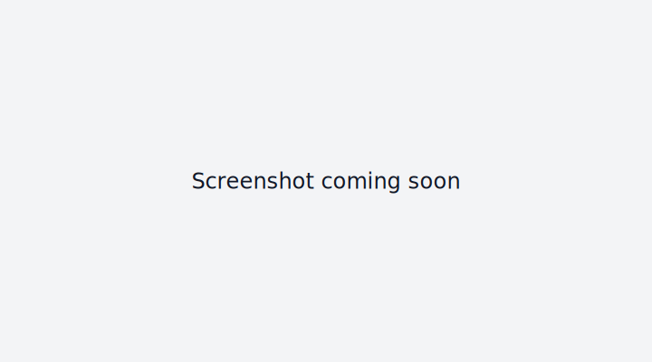
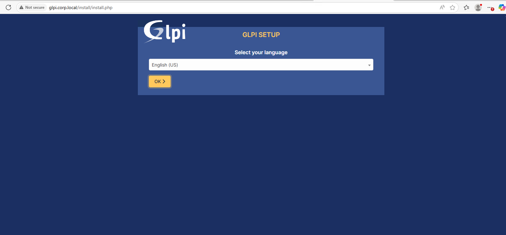

---

## Newly Added Screenshots

### Nagios Detail



### GLPI Detail



### Ansible


### Repos & Syslog


---

## Verification Commands (added to freeze)

### 🔎 Syslog Hub (UDP/TCP listeners)
```bash
# Verify imudp/imtcp config
grep -Ri "imudp" /etc/rsyslog.d/ /etc/rsyslog.conf
grep -Ri "imtcp" /etc/rsyslog.d/ /etc/rsyslog.conf

# Confirm sockets are listening
sudo ss -lunpt | grep 514   # UDP 514
sudo ss -ltnp  | grep 514   # TCP 514
```


### 💾 Backup Server Checks
```bash
# If using cron jobs
sudo crontab -l
sudo ls -l /etc/cron.*/*

# If using systemd timer
systemctl list-timers --all | grep backup
systemctl status backup.service
systemctl status backup.timer

# Check last backup run logs
tail -n 50 /var/log/rsync-backup.log
journalctl -u backup.service -n 50 --no-pager
```

### ⚡ One-liners for all Linux hosts (via Ansible)
```bash
ansible all -i inventory -b -m shell -a '  echo "=== $(hostname) ===";   hostnamectl;   ip -br a;   df -h --output=source,fstype,size,used,avail,pcent,target;   free -h;   cat /etc/redhat-release 2>/dev/null || cat /etc/os-release;   sudo firewall-cmd --list-all || true'
```

⚠️ Note: A previous run errored with `list index out of range` due to inventory parsing.  
Keep this screenshot as a record:


---


---

## ⚡ System State Collection via Ansible (Final Method)

Instead of fighting with long inline one-liners, we drop a standard script on every host and run it.  
This avoids quoting issues and makes re-freezing easy in the future.

### Step 1. Push script to all hosts
```bash
ansible all -i inventory -b -m copy -a 'content="#!/bin/bash
echo \"=== \$(hostname) ===\"
hostnamectl
ip -br a
df -h --output=source,fstype,size,used,avail,pcent,target
free -h
cat /etc/redhat-release 2>/dev/null || cat /etc/os-release
sudo firewall-cmd --list-all || true
" dest=/tmp/syscheck.sh mode=0755'
```

### Step 2. Run the script
```bash
ansible all -i inventory -b -m shell -a "/tmp/syscheck.sh"
```

### Step 3. (Optional) Save results
```bash
ansible all -i inventory -b -m shell -a "/tmp/syscheck.sh" | tee syscheck-results.txt
```

This ensures:
- Script is consistent across all hosts  
- Easy to rerun later without retyping long commands  
- Logs can be archived into the freeze repo (`facts/` or `infra-freeze-2025-09-15/`)  

---


---

## 📂 Syscheck Results Folder

A placeholder directory has been created:

```
infra-freeze-2025-09-15/
└─ syscheck-results/
```

Use it to store the outputs from the final system state script:

```bash
ansible all -i inventory -b -m shell -a "/tmp/syscheck.sh" | tee syscheck-results/syscheck-$(date +%F).log
```

> Each run can be timestamped and committed into Git for a full historical archive of host states.

---


