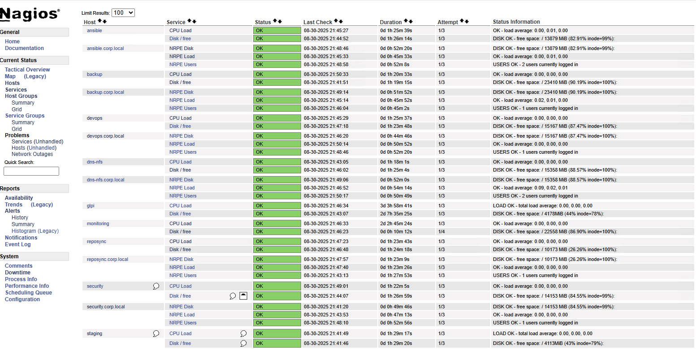
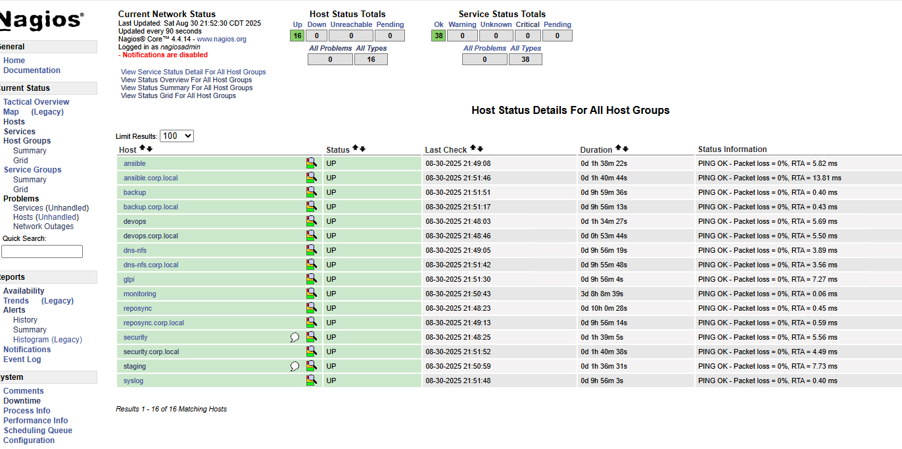

# Monitoring Server Deep Dive — Nagios Core Build Guide
**Host:** `monitoring.corp.local` (RHEL 9)  
**Last updated:** 2025-08-31  
**Author:** Olumide (with ChatGPT as co-pilot)

## 0) Outcome
Everything is **green**: all 16 hosts UP, all services OK.  


---

## 1) Prereqs & Packages
### 1.1 Repos
- Use **local EPEL** mirror for EL9: `local-epel`
- BaseOS/AppStream/CRB served from `reposync.corp.local`

### 1.2 Install
```bash
sudo dnf -y install nagios nagios-plugins-all nagios-plugins-nrpe httpd php
```
> If `nagios` is split by distro, install the equivalent metapackages; the plugins set must include `check_disk`, `check_load`, `check_procs`, `check_users`, and NRPE.

### 1.3 Services
```bash
sudo systemctl enable --now httpd nagios
sudo firewall-cmd --add-service=http --permanent && sudo firewall-cmd --reload
```

### 1.4 Web Auth
```bash
sudo htpasswd -c /etc/nagios/passwd nagiosadmin
```

---

## 2) Objects & Templates
Key files live under `/etc/nagios`:
```
/etc/nagios/nagios.cfg
/etc/nagios/objects/commands.cfg
/etc/nagios/objects/contacts.cfg
/etc/nagios/objects/templates.cfg
/etc/nagios/objects/hosts.cfg
/etc/nagios/objects/services.cfg
```

### 2.1 Commands
Ensure `check_nrpe` exists (plugins-nrpe package).
```cfg
define command {{
  command_name  check_nrpe
  command_line  /usr/lib64/nagios/plugins/check_nrpe -H $HOSTADDRESS$ -c $ARG1$
}}
```

### 2.2 Host templates
```cfg
define host{{
  name               linux-server
  use                generic-host
  check_period       24x7
  max_check_attempts 5
  check_interval     5
  retry_interval     1
  notification_period 24x7
  register           0
}}
```

### 2.3 Hosts
```cfg
define host{{ use linux-server; host_name ansible;   address 192.168.1.12 }}
define host{{ use linux-server; host_name backup;    address 192.168.1.16 }}
define host{{ use linux-server; host_name devops;    address 192.168.1.19 }}
define host{{ use linux-server; host_name dns-nfs;   address 192.168.1.14 }}
define host{{ use linux-server; host_name reposync;  address 192.168.1.13 }}
define host{{ use linux-server; host_name security;  address 192.168.1.20 }}
define host{{ use linux-server; host_name staging;   address 192.168.1.18 }}
define host{{ use linux-server; host_name syslog;    address 192.168.1.17 }}
define host{{ use linux-server; host_name glpi;      address 192.168.1.11 }}
define host{{ use linux-server; host_name monitoring; address 192.168.1.15 }}
```

### 2.4 Services (pattern)
```cfg
define service{{ use generic-service; host_name {"$HOST$"}; service_description CPU load;   check_command check_nrpe!check_load }}
define service{{ use generic-service; host_name {"$HOST$"}; service_description NRPE Users;  check_command check_nrpe!check_users }}
define service{{ use generic-service; host_name {"$HOST$"}; service_description NRPE Procs;  check_command check_nrpe!check_procs }}
define service{{ use generic-service; host_name {"$HOST$"}; service_description Disk / free; check_command check_nrpe!check_disk_root }}
```
> For `monitoring` itself, override `Disk / free` to use `check_local_disk`:
```cfg
define service{{ use generic-service; host_name monitoring; service_description Disk / free; check_command check_local_disk!20%!10%!/ }}
```

---

## 3) Client-Side NRPE
### 3.1 Install
**EL9:**
```bash
sudo dnf -y install nrpe nagios-plugins-all
```
**Ubuntu:**
```bash
sudo apt -y install nagios-nrpe-server nagios-plugins
```

### 3.2 Allow monitor + commands
```ini
# /etc/nagios/nrpe.cfg
allowed_hosts=127.0.0.1,192.168.1.15
include_dir=/etc/nagios/nrpe.d
```

```ini
# /etc/nagios/nrpe.d/common.cfg
command[check_load]=/usr/lib64/nagios/plugins/check_load -w 2.0,1.5,1.0 -c 4.0,3.0,2.0
command[check_users]=/usr/lib64/nagios/plugins/check_users -w 3 -c 5
command[check_procs]=/usr/lib64/nagios/plugins/check_procs -w 250 -c 400
command[check_disk_root]=/usr/lib64/nagios/plugins/check_disk -w 20% -c 10% -p /
```

### 3.3 Service + firewall
```bash
sudo systemctl enable --now nrpe || sudo systemctl enable --now nagios-nrpe-server
sudo firewall-cmd --add-port=5666/tcp --permanent || true
sudo firewall-cmd --reload || true
```

---

## 4) Validation
```bash
# From monitoring:
/usr/lib64/nagios/plugins/check_nrpe -H 192.168.1.16 -c check_load
nagios -v /etc/nagios/nagios.cfg
systemctl status nagios
journalctl -u nagios -e
```

---

## 5) Ansible
Include the two playbooks used in the overview doc:
- `ansible/playbooks/deploy-nrpe.yml`
- `ansible/playbooks/push-nagios-objects.yml`

**Optional role skeleton** (`roles/monitoring`):
```
roles/monitoring/tasks/main.yml
roles/monitoring/files/hosts.cfg
roles/monitoring/files/services.cfg
```

---

## 6) EPEL Mirror Notes
Initial EPEL sync pulled thousands of packages (first sync ~9K+). We mount HP2 and serve via Apache.

**Quick mirror checks:**
```bash
find /mnt/hp2-repo -maxdepth 6 -type f -name repomd.xml | grep '/epel/9/.*/x86_64/repodata/repomd.xml$' || true
curl -I http://reposync.corp.local/epel/9/Everything/x86_64/epel/repodata/repomd.xml
```

**Client repo example:**
```ini
[local-epel]
name=Local EPEL 9 (mirror)
baseurl=http://reposync.corp.local/epel/9/Everything/x86_64/epel/
enabled=1
gpgcheck=0
```

---

## 7) Ops Runbook
- Change window? Restart `nagios` after `nagios -v` passes.
- Add a new host:
  1. Define host in `hosts.cfg`.
  2. Add services in `services.cfg`.
  3. `nagios -v` then `systemctl restart nagios`.
- Add a new NRPE command:
  1. Drop to `/etc/nagios/nrpe.d/*.cfg` on client.
  2. `systemctl restart nrpe`.
  3. Update Nagios service to call it (`check_nrpe!<name>`).

---

## 8) Troubleshooting (Fast)
- **NRPE timeout** → port blocked or `allowed_hosts` missing.
- **UNKNOWN – plugin not found** → wrong path (`/usr/lib64/nagios/plugins` vs `/usr/lib/nagios/plugins`).
- **Disk check spam** → mount excludes: add `-i /boot -i /var/lib/containers` as needed.
- **UI stale** → force reschedule or `systemctl restart nagios` after config verify.

---

## 9) Evidence



---

## 10) Next
- Add email/pager notifications (postfix relay via `staging.corp.local` at 192.168.1.18).
- Author NRPE checks for: `/var/log` growth, critical daemons, and repo freshness.
- Tie alerts into **AIDE** and **rsyslog** events for passive security monitoring.
