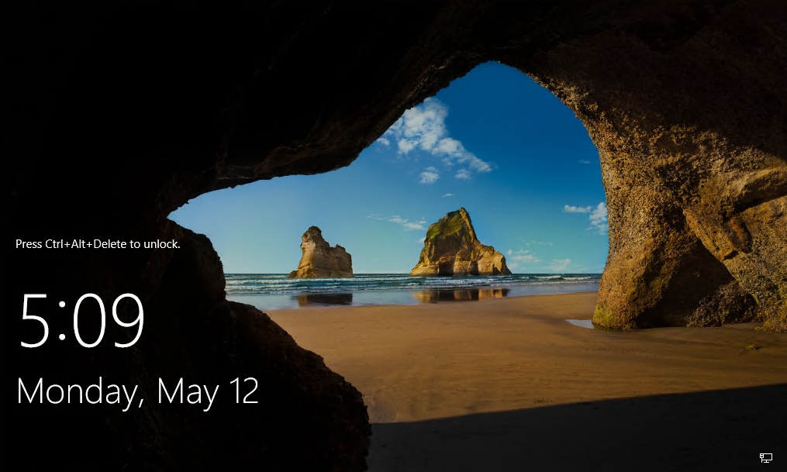
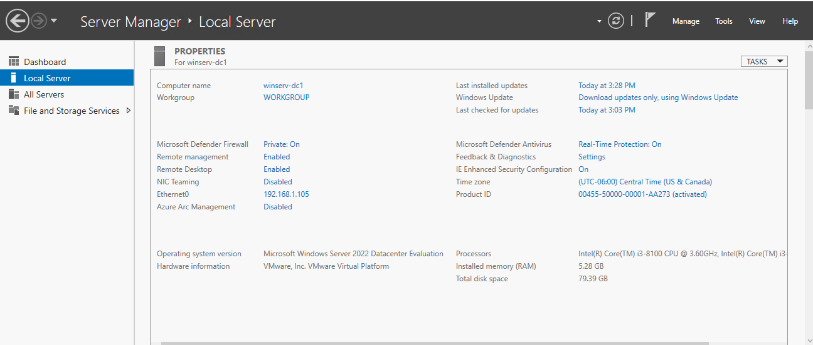
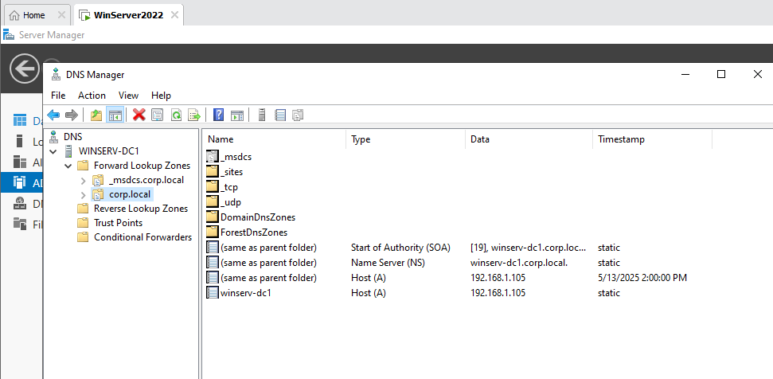
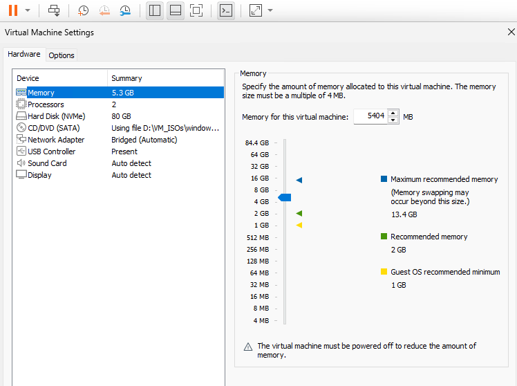

## 🧠 Windows AD & DNS Setup

This documentation captures key steps and configuration views for setting up Windows Server as an Active Directory Domain Controller and DNS server.

---

### 🖥️ First Boot Screen

This screenshot shows the first boot of the Windows Server VM.

---

### 🧾 Hostname Configuration

This VM was renamed to reflect its role in the domain (`winserv-dc1`).

---

### 🌐 DNS Zone Setup

This shows the DNS Manager with the `corp.local` zone and relevant A/NS/SOA records configured.

---

### ⚙️ VM Configuration

VM is configured with 2 vCPUs and 5.3 GB RAM.

